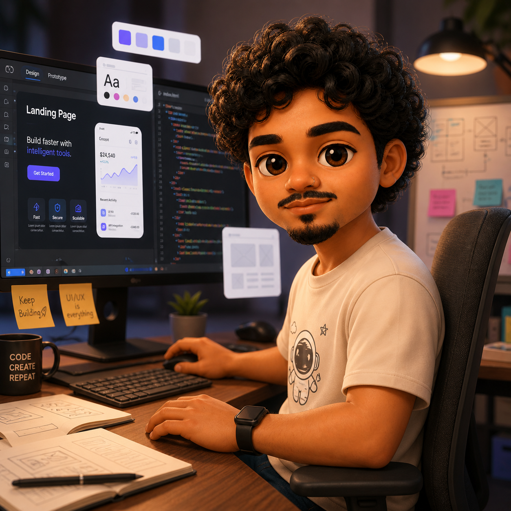

  

<h1 align="center">Hi, I'm Leonel Pedraza 👋</h1>

  <strong>Full-stack web developer focused on marketing software, dashboards, automation and API integrations.</strong>

  <a href="mailto:leopedraza.dev@gmail.com">Email</a> ·
  <a href="https://wachr.app">Wachr</a> ·
  <a href="https://github.com/LeonelPedraza">GitHub</a>

---

## Recruiter snapshot

I build full-stack products that connect clean interfaces with reliable backend services. My strongest experience is in SaaS-style dashboards, marketing automation, third-party API integrations and systems that help teams monitor, analyze and act on business data.

What I usually bring to a team:

- **Frontend engineering:** React, Next.js, TypeScript, UI architecture, reusable components and dashboard interfaces.
- **Backend engineering:** Node.js, Python, FastAPI, REST APIs, authentication flows and microservices.
- **Data and integrations:** MongoDB, Supabase, Google Ads API, Meta/LinkedIn/TikTok Ads-related workflows and automation logic.
- **Deployment and infrastructure:** Docker, Docker Compose, Traefik, Linux servers and production-oriented debugging.
- **Product mindset:** I care about performance, clarity, user workflows and building software that solves real business problems.

---

## Tech stack

  
  
  
  
  
  
  
  
  
  
  
  
  

---

## Selected work

### Indashin
Commercial dashboard used to manage and monitor Google Ads, Meta Ads, Linkedin Ads and Tiktok Ads.

**Highlights:**

- Production system operating for more than 2 years.
- Account hierarchy, budget control, history tracking and data synchronization.
- Backend services with Python, MongoDB, Docker and scheduled update processes.

### Wachr — always-on ad account monitoring
A SaaS product for paid media teams that monitors ad account KPIs and creates alerts when campaigns, budgets or performance move outside expected ranges.

**Highlights:**

- Multi-platform monitoring concept for Google Ads, Meta Ads, TikTok Ads and LinkedIn Ads.
- Incident-style alerting with severity and routing to Slack or email.
- Built with a product-first approach: clean UI, fast diagnosis and workflows for performance teams.

### Wuni — mobile audiobook player

A mobile audiobook player designed for long-form listening experiences, focused on smooth playback, reliable controls and a simple user experience.

**Highlights:**

- Built a custom audio playback flow with timeline progress, seek actions and player controls.
- Worked on player state consistency for long-duration audio files and repeated seek interactions.
- Designed a clean mobile interface with branded visual details, including splash screen styling and mascot animation.

---

## What I'm focused on now

- Building SaaS products for marketing, automation and paid media operations.
- Improving backend reliability, observability and scalable data flows.
- Designing cleaner dashboards with better UX for business users.
- Using AI as a practical layer inside real workflows, not as a buzzword.

---

## Contact

I'm interested in full-stack, product engineering and marketing-tech projects where software needs to be practical, reliable and useful for real teams.

  <strong>Email:</strong> <a href="mailto:leopedraza.dev@gmail.com">leopedraza.dev@gmail.com</a> 
  <strong>Website:</strong> <a href="https://wachr.app">wachr.app</a> 
  <strong>GitHub:</strong> <a href="https://github.com/LeonelPedraza">@LeonelPedraza</a>

